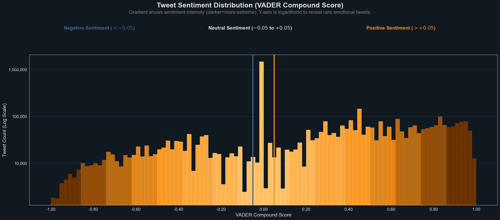

# Bitcoin Sentiment Analysis

Exploratory analysis of sentiment dynamics in Bitcoin-related tweets
using VADER compound sentiment scores.

## Motivation
Social media sentiment is often highly imbalanced toward neutral
expressions. Understanding the full sentiment distribution — especially
rare extreme emotional responses — is important for downstream modeling
and event-driven analysis.

## Approach
- Text preprocessing of Bitcoin-related tweets
- Sentiment scoring using VADER compound scores
- Log-scaled histogram visualization to preserve visibility of rare
  extreme sentiment values

## Example Output

## Interpretation
Most tweets cluster near neutral sentiment, creating a dominant central
peak. A logarithmic y-axis is used to prevent this mass from obscuring
low-frequency but high-magnitude sentiment events. The distribution
shows heavier positive sentiment tails relative to negative ones,
suggesting asymmetry in how sentiment is expressed around Bitcoin.

## Status
Work in progress. Future steps include temporal sentiment drift analysis
and integration with market data.

